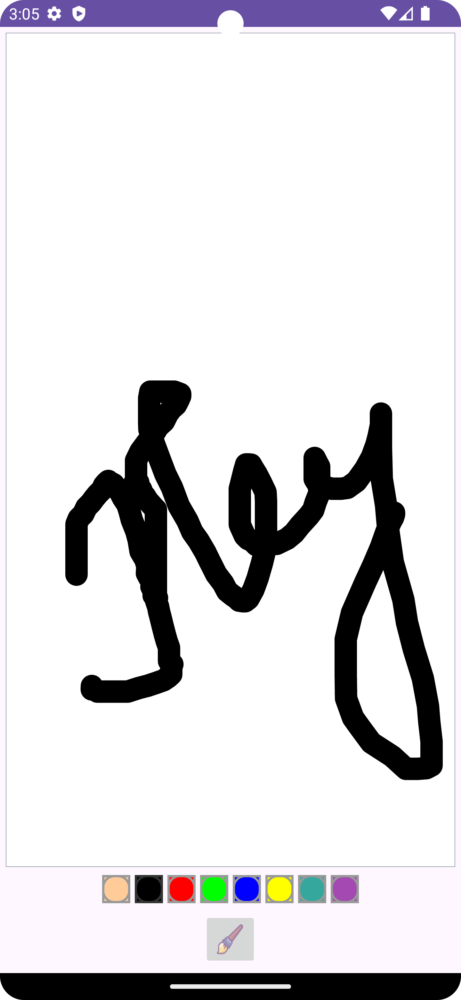

## Slate :tada: 🚀

A native android drawing application made with kotlin

The app has the following features
- Users can draw on the canvas
- Users can select the thickness of the paint brush
- Users can specify the color they need to draw

Made with ❤️ using `Kotlin`